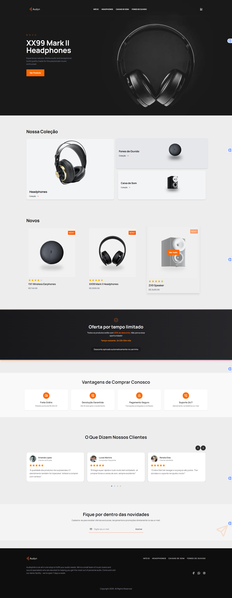

# 🎧 Audyn Store  

<div align="center">
 

<div data-badges>
    
    
  
    
    
</div>
</div>

---

Audiophile Store é um e-commerce moderno inspirado no desafio do Frontend Mentor, projetado para a venda de equipamentos de áudio premium. O projeto inclui catálogo de produtos, páginas detalhadas, sistema de carrinho de compras e foi desenvolvido com foco em **experiência do usuário, componentização e testes**.  

---

## 🌐 Acesse online  

A aplicação está hospedada e pode ser acessada no seguinte 🔗 [Link](https://audyn.vercel.app/)  

---

## 🗒️ Features do projeto 🗒️  

- Catálogo dinâmico de produtos  
- Páginas de produto detalhadas  
- Carrinho de compras funcional  
- Componentização e boas práticas de código  
- Testes automatizados com Jest e Testing Library  
- Layout totalmente responsivo  

  

---


## 🖥️ Como rodar este projeto 🖥️  

### Requisitos:  
- Node.js instalado  

### Execução:  

1. Clone este repositório:  

   ```sh
    https://github.com/GabrielTh58/audyn.git
   
2. Acesse o diretório do projeto:
   ```sh
    cd audyn

4. Instale as dependências:
   ```sh
    npm install
    # ou
    yarn install

4. Inicie a aplicação em ambiente de desenvolvimento:
   ```sh
      npm run dev
      # ou
      yarn dev
   
5. O projeto estará disponível em http://localhost:3000

--- 
## 💎 Links úteis 💎

- [Next.js](https://nextjs.org/docs)
- [NestJS](https://docs.nestjs.com/)
- [Prisma](https://www.prisma.io/docs)
- [PostgreSQL](https://www.postgresql.org/docs/)
- [Tailwind CSS](https://tailwindcss.com/docs)


